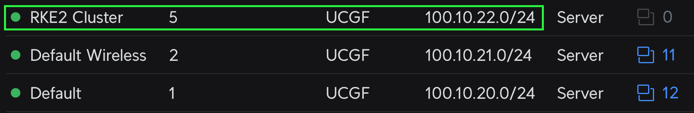

# Simple RKE2 Cluster Install in HA configuration
> with additional complementary "tools"<br/>

Goal for this cluster is to be used as a replacement for many-many-many Docker hosts I'm currently running in my [HomeLab](https://github.com/thecubbe/HomeLab)

Installation components:
- [RKE2](https://docs.rke2.io) - Enterprise-ready next-gen. Kubernetes distribution
- [kube-vip](https://kube-vip.io/) - Provides virtual IP (for HA) and load balancer
- [cert-manager](https://cert-manager.io) - Cloud native certificate management
- [traefik](https://traefik.io/traefik) - Reverse proxy and ingress controller 
- [Rancher](https://www.suse.com/products/suse-rancher/) - Multi-Cluster Kubernetes Management
- [Longhorn](https://longhorn.io) - Unified storage layer

## Prerequisites
For this setup we will need 5 linux machines and list of asigned IP addresses.<br/>
I'll be running 5 linux VMs created with [Ubuntu](https://cloud-images.ubuntu.com/) CloudInit templates, on [PVE](https://pve.proxmox.com/)

- 3 VMs will be dedicated rke2 Server nodes (*roles: control-plane, etcd, master*)
- 2 VMs will act as Worker / Agent nodes

| | *Hostname* | *CPU* | *Memory* | *Local IP address* | *VM disk size* | *distro* |
|---| --- | --- | --- | --- | --- | --- |
| **Servers** |`rke2s01` | 4c (1 sockets, 4 cores) | 8 GiB | 100.10.22.**31** | 50 GB | Ubuntu 24.04 amd x64 |
|             |`rke2s02` | 4c (1 sockets, 4 cores) | 8 GiB | 100.10.22.**32** | 50 GB | Ubuntu 24.04 amd x64 |
|             |`rke2s03` | 4c (1 sockets, 4 cores) | 8 GiB | 100.10.22.**33** | 50 GB | Ubuntu 24.04 amd x64 |
| **Agents**  |`rke2a01` | 4c (1 sockets, 4 cores) | 8 GiB | 100.10.22.**41** | 50 GB | Ubuntu 24.04 amd x64 |
|             |`rke2a02` | 4c (1 sockets, 4 cores) | 8 GiB | 100.10.22.**42** | 50 GB | Ubuntu 24.04 amd x64 |

>I would suggest creating dedicated VLAN for this cluster and assigning static IP to every instance.<br/>
>


## RKE2 Install
### Server Node #1 `rke2s01`

```bash
# Login to first VM with SSH as a root user
ssh -tt administrator@100.10.22.31 sudo su
```
```bash
# stop the system firewall
systemctl disable --now ufw
```
```bash
# get updates, install nfs, and apply
apt update
apt install nfs-common -y  
apt upgrade -y
```
```bash
# clean up
apt autoremove -y
```

We will begin installing **kube-vip** in parallel with RKE2

Lets first check network interface:
```bash
ip a
```
*Network interface - Output:* <br/>
>2: `eth0`: <BROADCAST,MULTICAST,UP,LOWER_UP> mtu 1500 qdisc fq_codel state UP group default qlen 1000
>    link/ether ab:cd:ef:gh:ij:kl brd ff:ff:ff:ff:ff:ff
>    altname enp0s18 <br/>
>    inet **100.10.22.31/24** metric 100 brd 100.10.22.255 scope global dynamic `eth0`
>       valid_lft 85664sec preferred_lft 85664sec
>    inet6 abcd::efgh:ijkl:mn0p:r5tv/64 scope link
>       valid_lft forever preferred_lft forever

Find out the latest version of the kube-vip release by parsing the GitHub API
```bash
curl -sL https://api.github.com/repos/kube-vip/kube-vip/releases | jq -r ".[0].name"
```
*Latest version - Output:* `v0.9.2` <br/>
<sub>*as of 07/2025*</sub>


Create variables for virtual IP, server nodes IPs, network interface and kube-vip version
> make sure your selected virtual ip is free (*not assigned to any device/VM*) and outside of DHCP pool
```bash 
export RKE2_API_VIP=100.10.22.10       # kube-vip virtual IP 
export RKE2_SERVER_01_IP=100.10.22.31  # rke2s01
export RKE2_SERVER_02_IP=100.10.22.32  # rke2s02
export RKE2_SERVER_03_IP=100.10.22.33  # rke2s03
export NETWORK_INTERFACE=eth0          # interface name
export KVVERSION=v0.9.2                # version of the kube-vip release
```

Get and modify official RKE2 install script
```bash 
curl -sfL https://get.rke2.io --output rke2-install.sh

chmod +x rke2-install.sh

sudo mkdir -p /etc/rancher/rke2/
```


Create RKE2 config.yaml file for our Server #1 
```bash 
cat <<EOF | tee /etc/rancher/rke2/config.yaml
node-name:
  - "rke2s01"
token: Your-Shared-Secret 
tls-san:
  - ${RKE2_API_VIP}
  - ${RKE2_SERVER_01_IP}
  - ${RKE2_SERVER_02_IP}
  - ${RKE2_SERVER_03_IP}
etcd-extra-env: TZ=Europe/Vienna
kube-apiserver-extra-env: TZ=Europe/Vienna
kube-controller-manager-extra-env: TZ=Europe/Vienna
kube-proxy-extra-env: TZ=Europe/Vienna
kube-scheduler-extra-env: TZ=Europe/Vienna
cloud-controller-manager-extra-env: TZ=Europe/Vienna
EOF
```

```bash
# Check config:
cat /etc/rancher/rke2/config.yaml
```

> <br/>
>Edited config.yaml file should look something like this:
```yaml
node-name:
  - "rke2s01"
token: Your-Shared-Secret 
tls-san:
  - 100.10.22.10
  - 100.10.22.31
  - 100.10.22.32
  - 100.10.22.33
etcd-extra-env: TZ=Europe/Vienna
kube-apiserver-extra-env: TZ=Europe/Vienna
kube-controller-manager-extra-env: TZ=Europe/Vienna
kube-proxy-extra-env: TZ=Europe/Vienna
kube-scheduler-extra-env: TZ=Europe/Vienna
cloud-controller-manager-extra-env: TZ=Europe/Vienna
```
**Create RKE2:**
```bash
sudo INSTALL_RKE2_CHANNEL=v1.31.3+rke2r1 ./install.sh

export PATH=$PATH:/opt/rke2/bin

# start and enable for restarts - 
systemctl enable --now rke2-server.service
```

kubeconfig
```bash
mkdir ~/.kube

sudo cp /etc/rancher/rke2/rke2.yaml ~/.kube/config

sudo cp /var/lib/rancher/rke2/bin/* /usr/local/bin/

sudo cp /opt/rke2/bin/* /usr/local/bin/
```

```bash 
kubectl get node
```

kube-vip RBAC
```bash
curl https://kube-vip.io/manifests/rbac.yaml > /var/lib/rancher/rke2/server/manifests/kube-vip-rbac.yaml
```

```bash 
/var/lib/rancher/rke2/bin/crictl -r "unix:///run/k3s/containerd/containerd.sock"  pull ghcr.io/kube-vip/kube-vip:$KUBE_VIP_VERSION

CONTAINERD_ADDRESS=/run/k3s/containerd/containerd.sock  ctr -n k8s.io run \
--rm \
--net-host \
ghcr.io/kube-vip/kube-vip:$KVVERSION vip /kube-vip manifest daemonset --arp --interface $NETWORK_INTERFACE --address $RKE2_API_VIP --controlplane  --leaderElection --taint --services --inCluster | tee /var/lib/rancher/rke2/server/manifests/kube-vip.yaml
```

```bash 
ubectl -n kube-system get po
```


### Server Node #2 `rke2s02`

```bash
Login to the second VM as a root use
ssh -tt administrator@100.10.22.32 sudo su
```
